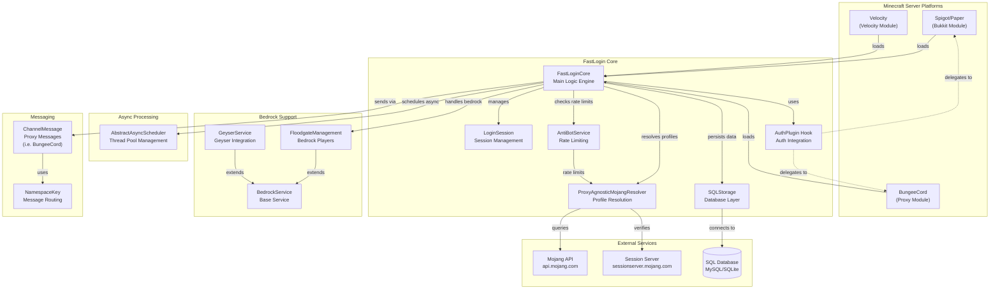

# Contributing Guide

## Architectural overview

```mermaid
graph TB
    subgraph "Minecraft Server Platforms"
        SPIGOT["Spigot/Paper<br/>(Bukkit Module)"]
        BUNGEE["BungeeCord<br/>(Proxy Module)"]
        VELOCITY["Velocity<br/>(Velocity Module)"]
    end

    subgraph "FastLogin Core"
        CORE["FastLoginCore<br/>Main Logic Engine"]
        SESSION["LoginSession<br/>Session Management"]
        AUTH["AuthPlugin Hook<br/>Auth Integration"]
        RESOLVER["ProxyAgnosticMojangResolver<br/>Profile Resolution"]
        STORAGE["SQLStorage<br/>Database Layer"]
        ANTIBOT["AntiBotService<br/>Rate Limiting"]
    end

    subgraph "Bedrock Support"
        FLOODGATE["FloodgateManagement<br/>Bedrock Players"]
        GEYSER["GeyserService<br/>Geyser Integration"]
        BEDROCK["BedrockService<br/>Base Service"]
    end

    subgraph "External Services"
        MOJANG["Mojang API<br/>api.mojang.com"]
        SESSION_SERVER["Session Server<br/>sessionserver.mojang.com"]
        DATABASE[(SQL Database<br/>MySQL/SQLite)]
    end

    subgraph "Async Processing"
        SCHEDULER["AbstractAsyncScheduler<br/>Thread Pool Management"]
    end

    subgraph "Messaging"
        MESSAGES["ChannelMessage<br/>Proxy Messages <br/>(i.e. BungeeCord)"]
        NAMEKEY["NamespaceKey<br/>Message Routing"]
    end

    SPIGOT -->|loads| CORE
    BUNGEE -->|loads| CORE
    VELOCITY -->|loads| CORE

    CORE -->|manages| SESSION
    CORE -->|uses| AUTH
    CORE -->|resolves profiles| RESOLVER
    CORE -->|persists data| STORAGE
    CORE -->|checks rate limits| ANTIBOT
    CORE -->|handles bedrock| FLOODGATE

    FLOODGATE -->|extends| BEDROCK
    GEYSER -->|extends| BEDROCK

    RESOLVER -->|queries| MOJANG
    RESOLVER -->|verifies| SESSION_SERVER

    STORAGE -->|connects to| DATABASE

    CORE -->|schedules async| SCHEDULER

    MESSAGES -->|uses| NAMEKEY
    CORE -->|sends via| MESSAGES

    AUTH -.->|delegates to| SPIGOT
    AUTH -.->|delegates to| BUNGEE

    ANTIBOT -->|rate limits| RESOLVER
```
